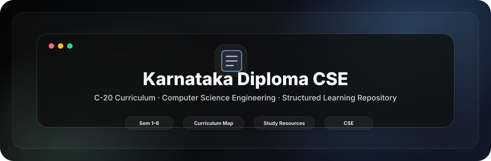
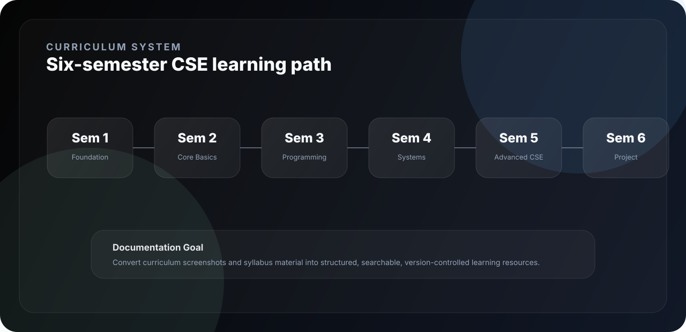
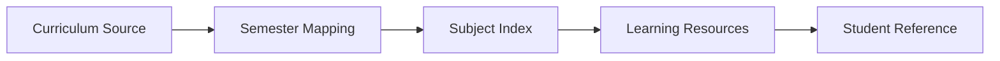

<div align="center">



<br />

<p>
  <strong>Structure curriculum.</strong> <strong>Index semesters.</strong> <strong>Maintain learning resources.</strong>
</p>

<p>
  
  
  
  
</p>

</div>

---

<div align="center">

<table>
<tr>
<td align="center" width="25%"><strong>Program</strong><br />Diploma CSE</td>
<td align="center" width="25%"><strong>Scheme</strong><br />C-20</td>
<td align="center" width="25%"><strong>Coverage</strong><br />Semesters 1–6</td>
<td align="center" width="25%"><strong>Use</strong><br />Study Reference</td>
</tr>
</table>

</div>

---

## 01 · Overview

<table>
<tr>
<td width="58%" valign="top">

### A structured curriculum repository for Diploma CSE

This repository organizes the Karnataka Diploma Computer Science & Engineering C-20 curriculum into a clean, version-controlled learning reference.

It is designed for students, educators, and maintainers who need a reliable index of semester-wise subjects, curriculum structure, and future digital learning resources.

</td>
<td width="42%" valign="top">

```text
┌──────────────────────────────┐
│  CURRICULUM SYSTEM           │
├──────────────────────────────┤
│  Program    Diploma CSE      │
│  Scheme     C-20             │
│  Scope      Sem 1 to Sem 6   │
│  Format     Docs + Assets    │
│  Goal       Learning Index   │
└──────────────────────────────┘
```

</td>
</tr>
</table>

---

## 02 · Curriculum Map



---

## 03 · Semester Index

<table>
<tr>
<td width="33%" valign="top">

### Semester 1

Foundation-level technical and general engineering subjects.

</td>
<td width="33%" valign="top">

### Semester 2

Core computing basics, mathematics, and engineering fundamentals.

</td>
<td width="33%" valign="top">

### Semester 3

Programming, database, digital concepts, and laboratory practice.

</td>
</tr>
<tr>
<td width="33%" valign="top">

### Semester 4

Systems, software engineering, operating systems, and applied computing.

</td>
<td width="33%" valign="top">

### Semester 5

Advanced computer science subjects, electives, and practical skill development.

</td>
<td width="33%" valign="top">

### Semester 6

Project work, professional preparation, internships, and advanced applications.

</td>
</tr>
</table>

---

## 04 · Repository Workflow



---

## 05 · Key Features

| Feature | Purpose |
|---|---|
| Semester-wise structure | Organizes the CSE diploma path from Semester 1 to Semester 6. |
| Curriculum reference | Provides a central place for syllabus and academic planning material. |
| Version-controlled docs | Keeps updates and changes transparent through Git history. |
| Learning-resource direction | Designed to evolve into notes, links, labs, and structured study guides. |
| Student-friendly navigation | Clean sections for quick access to semester-level information. |
| Educator-ready format | Suitable for maintaining curriculum data in a public repository. |

---

## 06 · Usage

Clone the repository:

```bash
git clone https://github.com/ns7523/Karnataka-Diploma-CSE.git
cd Karnataka-Diploma-CSE
```

Use the repository as a reference index for curriculum materials, semester planning, and future structured resources.

---

## 07 · Project Structure

```text
.
├── assets/
│   └── brand/
│       ├── curriculum-map.svg
│       └── hero.svg
└── README.md
```

Suggested production structure:

```text
curriculum/ · data/ · docs/ · assets/screenshots/ · README.md
```

---

## 08 · Visual Assets

<table>
<tr>
<td width="50%" valign="top">

### Semester Matrix

`assets/screenshots/semester-matrix.png`

Clean visual overview of all semester subjects.

</td>
<td width="50%" valign="top">

### Subject Index

`assets/screenshots/subject-index.png`

Searchable list of subjects, credits, and labs.

</td>
</tr>
<tr>
<td width="50%" valign="top">

### Resource Map

`assets/screenshots/resource-map.png`

Links between subjects, notes, labs, and references.

</td>
<td width="50%" valign="top">

### Curriculum Data

`assets/screenshots/curriculum-data.png`

Example structured JSON/YAML curriculum data.

</td>
</tr>
</table>

---

## 09 · Future Improvements

- [ ] Convert semester screenshots into Markdown tables.
- [ ] Add one file per semester under `curriculum/`.
- [ ] Add structured subject data as JSON/YAML.
- [ ] Add study resources and reference links per subject.
- [ ] Add lab-program indexes where applicable.
- [ ] Add a searchable subject index.
- [ ] Add a formal open-source license.

---

<div align="center">

### N S Akash

**AI & Cybersecurity Engineer**

<p>
  <a href="https://github.com/ns7523"></a>
  <a href="https://nsakash.in"></a>
  <a href="mailto:contact@nsakash.in"></a>
  <a href="https://www.linkedin.com/in/nsakash7523"></a>
</p>

</div>
